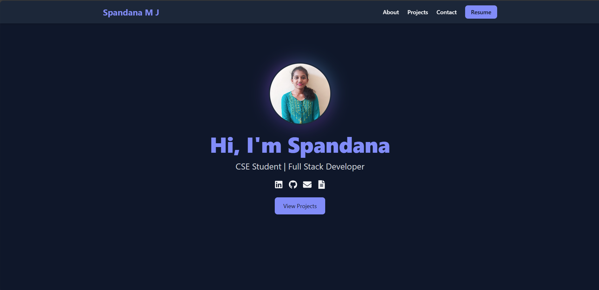
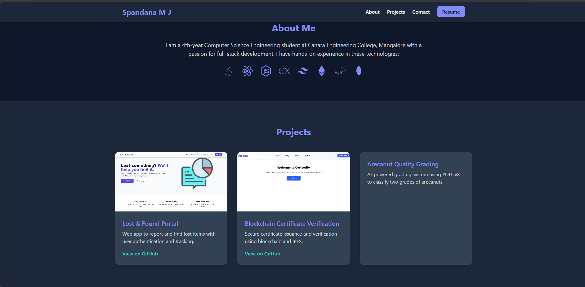

# 👋 Hi, I'm Spandana Mj

Welcome to my personal portfolio!  
This project showcases my skills, projects, and achievements in **Web Development, Blockchain, and AI**.

---

## 🖥️ About Me

🎓 I'm a passionate software engineer and web developer focused on building impactful and user-friendly applications.  
💡 I enjoy solving real-world problems through technology — from **MERN stack**  and **Blockchain DApps**.

---

## 🚀 Tech Stack

**Frontend:** React, Tailwind CSS, HTML, CSS, JavaScript  
**Backend:** Node.js, Express  
**Database:** MongoDB  
**Blockchain:** Solidity, Hardhat, Ethereum  
**Tools:** Git, VS Code, Postman

---

## 🌟 Featured Projects

| Project | Description | Tech Used |
|----------|--------------|------------|
| [Lost & Found System](https://github.com/Spandana-MJ/lost-found) | MERN app for reporting and verifying lost & found items | React, Node, MongoDB |
| [Certificate Verification on Blockchain](https://github.com/Spandana-MJ/CertVerify) | Verifies academic certificates using smart contracts | Solidity, Hardhat, React |
| [Arecanut Quality Detection](#) | AI project to detect quality of arecanuts using YOLOv8 | Python, Deep Learning |

---

## 🧾 Portfolio Screenshot

---

## 📫 Connect With Me

🌐 **Portfolio Website:** [portfolio-link.com](https://my-portfolio-alpha-one-48.vercel.app)  
💼 **LinkedIn:** [linkedin.com/in/spandana-mj](https://linkedin.com/in/Spandana-MJ)  
📧 **Email:** spandanaspandumj@gmail.com  
🐙 **GitHub:** [github.com/Spandana-MJ](https://github.com/Spandana-MJ)

---

⭐ *If you like my work, consider giving this repo a star!*
